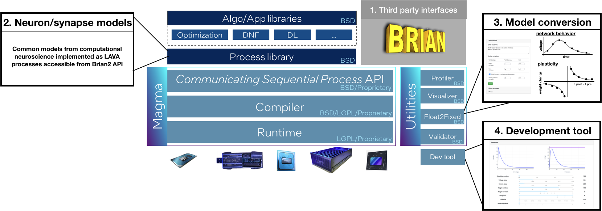

The goal of this open source project is to develop a [Brian2](https://brian2.readthedocs.io/) interface for [Lava](https://lava-nc.org/), called Brian2Lava, to facilitate deployment of brain-inspired algorithms on Lava-supported neuromorphic hardware and emulator backends. Brian2 is an open source Python package developed and used by the computational neuroscience community to simulate spiking neural networks. 

By harnessing the power of differential equation based model definition, and enabling deployment on emulator backends via Lava, Brian2Lava aims to expedite prototyping. At the same time, Brian2Lava will be beneficial for users at all stages. Our aim is to reduce entry barriers, enable efficient algorithm development, and ease the execution of existing Brian2 models on neuromorhphic backends (e.g. Loihi1 and Loihi2).

Beyond the interface, we are developing utilities that streamline model development and deployment. By enabling emulation of neuroscience-inspired models using Lava processes, this project will develop an efficient pipeline for prototyping large scale algorithms, accessible to Brian2 and Lava users. Importantly, with CPU/GPU based emulator backends, Brian2Lava and the Lava development tools can serve to demonstrate the practical feasibility of neuromorphic computing to students and researchers who do not have chip access yet.

Our goal is to build a comprehensive framework allowing users and developers to program in Brian2 or Lava and deploy their algorithms on either neuromorphic hardware or CPUs/GPUs (see diagram below). This framework takes inspiration from our existing Brian2Loihi emulator (Michaelis, Lehr, Oed, & Tetzlaff, 2021), our PeleNet framework for reservoir computing (Michaelis, 2020) to provide the following features:

1. A Brian2 interface allowing users, especially from the computational neuroscience community, to develop in Brian2 with efficient differential equation based model definitions;
2. Neuron and synapse models will be implemented as Lava processes to enable execution of neural network simulations on neuromorphic hardware as well as conventional CPUs and GPUs;
3. A graphical development tool to flexibly fit and tune complex neuron and synapse models to provided Loihi2 models.

Interested in contributing? We'd love to hear from you!
